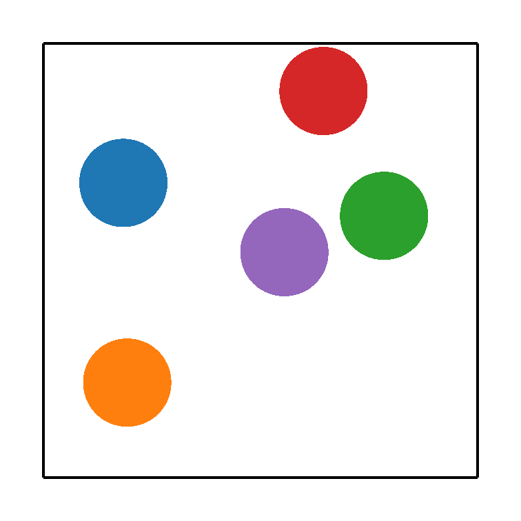
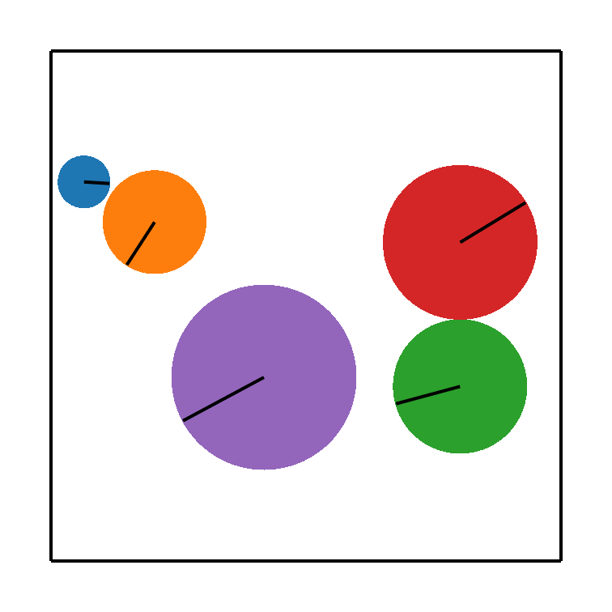
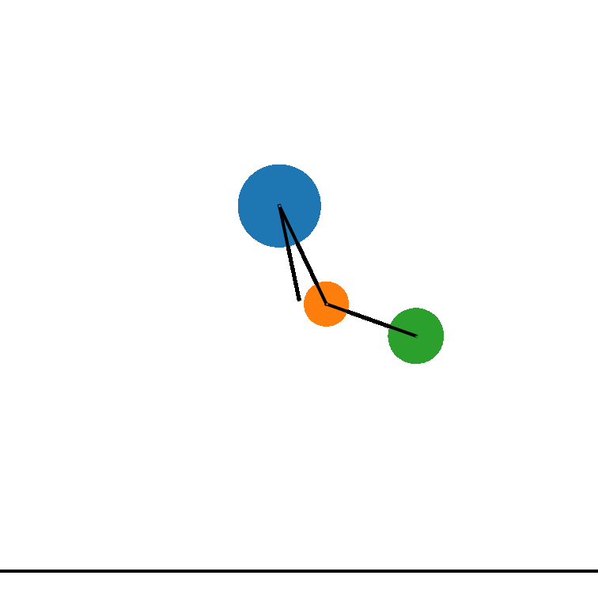
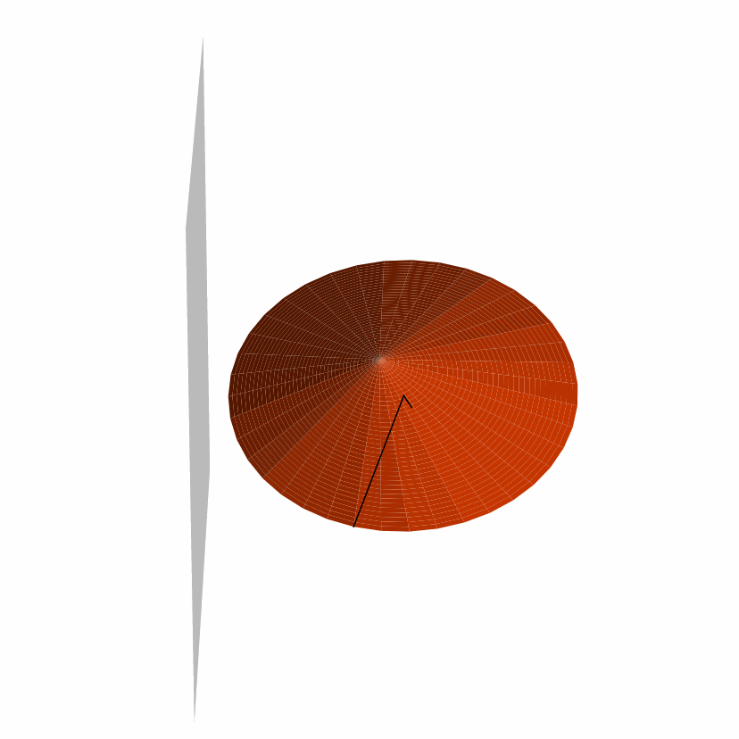
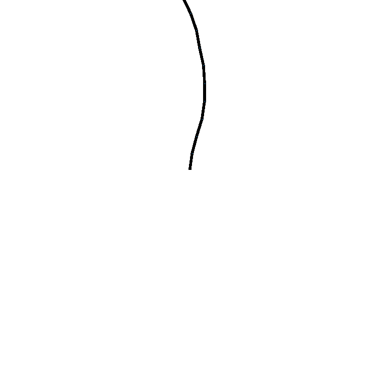
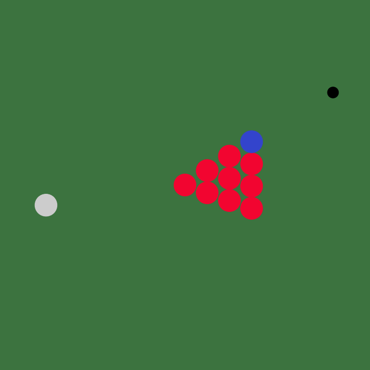
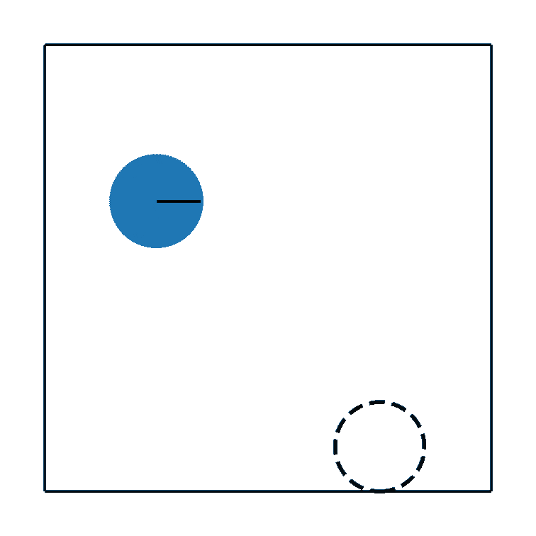
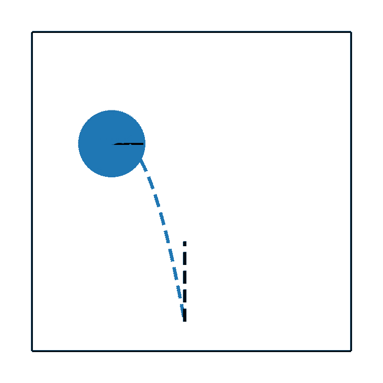

---

<div align="center">    
 
# Extending Lagrangian and Hamiltonian Neural Networks with Differentiable Contact Models

Yaofeng Desmond Zhong, Biswadip Dey, Amit Chakraborty | 2021

[](https://arxiv.org/abs/2102.06794)
[](https://arxiv.org/abs/2102.06794)


</div>

This repository is the official implementation of [Extending Lagrangian and Hamiltonian Neural Networks with Differentiable Contact Models](https://arxiv.org/abs/2102.06794). 

## Reproducibility

This implementation is written with [PyTorch](https://pytorch.org/) and handles training with [PyTorch-Lightning](https://github.com/PyTorchLightning/pytorch-lightning), which makes our code easy to read and our results easy to reproduce. 

The code in this branch is refactored so that the model names in the code match the model names in the paper. If you'd like reproduce the result exactly as in the paper, please check out the `archive` branch in this repo. 

To install all dependencies:
```bash
pip install -r requirements.txt
```

## Dataset

All the data can be generated by [datasets.py](./datasets/datasets.py). It might take a while to generate the dataset, so we also host the dataset on github releases. You can download the dataset [here](https://github.com/Physics-aware-AI/DiffCoSim/releases/download/v0.0.1/DiffCoSim_data.zip). Please unzip the dataset into the `./datasets` folder.

## Training

__Here are the commands that you can use for dynamics and parameter learning.__
```python
# train CM-CD-CLNN models
# BP5-e
python trainer.py --body-class BouncingPointMasses --body-kwargs-file _BP5-e 
# BP5
python trainer.py --body-class BouncingPointMasses --body-kwargs-file _BP5 
# BD5
python trainer.py --body-class BouncingDisks --body-kwargs-file _BD5 
# CP3-e
python trainer.py --body-class ChainPendulumWithContact --body-kwargs-file _CP3-e 
# CP3
python trainer.py --body-class ChainPendulumWithContact --body-kwargs-file _CP3
# Rope 
python trainer.py --body-class Rope --body-kwargs-file Rope_default
# Gyro-e
python trainer.py --body-class GyroscopeWithWall --body-kwargs-file _Gyro-e 
# Gyro
python trainer.py --body-class GyroscopeWithWall --body-kwargs-file _Gyro 

# To train CM-CD-CHNN models, please add `--network-class CHNNwC` to the above commands.

# To train CMr-CD-CLNN models, please add `--is-reg-model` to the above commands.

# To train CMr-CD-CHNN models, please add `--network-class CHNNwC --is-reg-model` to the above commands.

# You can also set the `--network-class` to train baseline models, see trainer.py for more details.
```

__Here are the commands for downstream tasks.__
```python
# Downstream tasks: billiard
python trainer_billiards.py

# Downstream tasks: throwing (with ground truth system and contact properties)
python trainer_throwing.py --task hit
python trainer_throwing.py --task vertical_nospin

# Downstream tasks: throwing (with learned system and contact properties)
# first learn system and contact properties
python trainer.py --body-class BouncingDisks --body-kwargs-file BD1_homo_cor0.8_mu0.2 --batch_size 1
# then use the learned properties for downstream tasks
python trainer_throwing.py --task hit --use-learned-properties --ckpt-path "./logs/BD1_homo_cor0.8_mu0.2_CLNNwC_N800/version_0/last.ckpt"
python trainer_throwing.py --task vertical_nospin --use-learned-properties --ckpt-path "./logs/BD1_homo_cor0.8_mu0.2_CLNNwC_N800/version_0/last.ckpt"
```

## Pretrained models and tensorboard event files

Pre-trained models can be downloaded from github releases ([Here's the link](https://github.com/Physics-aware-AI/DiffCoSim/releases/download/v0.0.1/DiffCoSim_pretrained_models.zip)). 

Please unzip the downloaded file into the root folder of these repo. Note that all the pretrained models are expected to be found in the `./logs` folder if you'd like to run the notebooks in the `./analysis` folder.

## Experiments: dynamics and parameter learning 

We perform dynamics and parameter learning on five systems - bouncing point masses, bouncing disks, chained pendulums with ground, gyroscope with wall and rope. 
The following animation are prediction animations by our CM-CD-CLNN model, which is generated in [plot_prediction_gifs.ipynb](./analysis/plot_prediction_gifs.ipynb).

| bouncing point masses | bouncing disks | chained pendulums with ground 
| :---------:|:------:|:------------------------:|
 |  | 

| gyroscope with wall | rope 
| :---------:|:------:|
 |  


## Experiments: downstream tasks

After learning the dynamics, our model can be viewed as a differentaible physics simulator for downstream tasks. Here are the billiards and throwing animations generated in [billiards.ipynb](./analysis/billiards.ipynb) and [throwing.ipynb](./analysis/throwing.ipynb). 



 

## Acknowledgement

This implementation uses various open source codebases, in particular,  by Marc Finzi and Alex Wang.